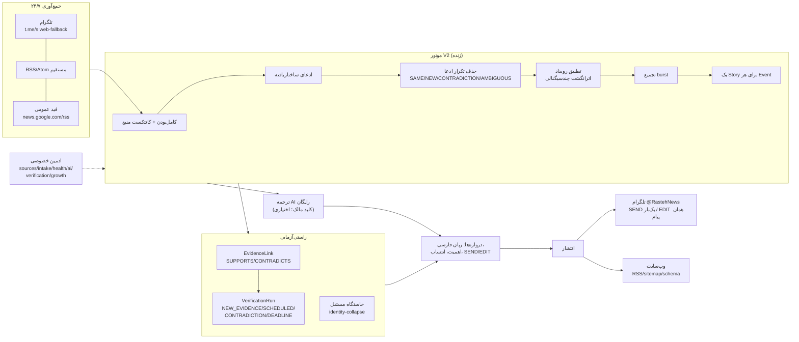

# راسته؟ (Rasteh) — تحریریه خبری خودکارِ مبتنی بر شواهد

[](https://github.com/DashSaman/akh-bot/actions/workflows/ci.yml)

سیستم خبری ۲۴/۷ فارسی: پایش منابع → استخراج ادعا → راستی‌آزمایی مبتنی بر شواهد →
متن فارسی خنثی → انتشار در تلگرام [@RastehNews](https://t.me/RastehNews) + وب.
**بدون وابستگی به عامل انسانی یا AI پولی** — موتور قطعی (deterministic) به‌طور پیش‌فرض؛
ترجمه AI اختیاری و رایگان (کلید مالک → فعال، بدون تغییر کد).

> خروجی عمومی فقط فارسی (fail-closed): محتوای خارجی هرگز خام منتشر نمی‌شود.

## معماری



## جریان V2 (خلاصه)
1. **جمع‌آوری**: هر endpoint با فاصله‌ی سطح-سرعت خودش (۱۲۰s سریع تا ۱۸۰۰s رویدادی)؛ watermark با قاعده persist-then-advance — هیچ پیامی گم نمی‌شود.
2. **کامل‌بودن**: فرگمنت‌ها («ترامپ:»، «فوری:») فقط کانتکست می‌دهند؛ هرگز به‌تنهایی منتشر نمی‌شوند.
3. **ادعا/رویداد**: ادعای ساختاریافته → dedup چندمرحله‌ای → تطبیق سه‌طرفه → **یک Story برای هر رویداد واقعی**.
4. **راستی‌آزمایی**: هر شاهد یک EvidenceLink؛ خاستگاه مستقل = هویت canonical (Reuters+X آن = ۱ منشأ؛ فوروارد = تکرار). تناقض trace می‌شود، هرگز خودکار حل نمی‌شود.
5. **انتشار**: تیتر = قوی‌ترین ادعا؛ جزئیات ≤ `MAX_PUBLIC_STORY_DETAILS`؛ **SEND یک‌بار**، به‌روزرسانی material → StoryVersion++ → **EDIT همان پیام تلگرام** (گارد سخت در runner).
6. **ترجمه** (با کلید رایگان): منبع خارجی → ترجمه → ممیزی consistency (عدد/نفی/قطعیت) → همان دروازه‌ها؛ شکست → HELD.

## ویژگی‌های کلیدی
- **حفاظت بازگشتی**: محتوای قدیمی‌تر از فعال‌سازی منبع STORE_ONLY است.
- **تبار/هویت منبع**: ۱۱۰ اندپوینت / ۷۸ هویت canonical — اندپوینت ≠ خاستگاه مستقل.
- **گیت‌های پرخطر**: تلفات متعارض/تک‌منبعی هرگز تیتر قطعی نمی‌شوند (HELD).
- **تغییرناپذیری شواهد**: ویرایش پیام منبع = نسخه جدید؛ اصل حفظ می‌شود.
- **سبک**: FastAPI + SQLite WAL + asyncio؛ بدون Redis/Celery/K8s؛ idle ~۶۵MB RAM، CPU <۱٪ با ۵۸ اندپوینت فعال.

## اجرا / بهره‌برداری
```bash
cp .env.example .env            # مقادیر را پر کنید
bash scripts/deploy.sh          # build + run (فقط akhbot-app)
bash scripts/backup_db.sh       # بکاپ آنلاین WAL-safe
bash scripts/dr_drill.sh <bak>  # تمرین بازیابی ایزوله (هرگز روی DB زنده)
python scripts/validate_governance.py
pytest tests/ -q                # ~۳۰۰ تست
```

## افزودن منبع / کلید AI / پلتفرم
- **منبع**: `/admin/sources` (CRUD + test/fetch-now) یا XLSX مالک → `scripts/import_source_xlsx.py` → `import_full_registry()`. هویت canonical (Entity ID) تضمین می‌کند اندپوینت‌های یک سازمان = یک خاستگاه.
- **AI رایگان**: `GEMINI_API_KEY=` (یا `GROQ_API_KEY`/`OPENROUTER_API_KEY`) در `/opt/akhbot/.env` → `bash scripts/deploy.sh`. مدیریت/تست زنده: `/admin/ai`.
- **پلتفرم**: `platform_accounts` (CORE-009) — هر پلتفرم مستقل؛ فقط API رسمی مجاز (هرگز scraping).
- اقدامات نیازمند مالک: [docs/OWNER-ACTION-REQUIRED.md](docs/OWNER-ACTION-REQUIRED.md)

## امنیت
کلیدها فقط در `.env` (هرگز git/DB/لاگ — redaction فعال). ادمین پشت auth دو‌مرحله‌ای دامنه خصوصی. انتشار عمومی فقط از مسیر canonical Story با دروازه‌های fail-closed. جداسازی هاست: فقط کانتینر akhbot-app.

## مستندات
[00-وضعیت](docs/00-CURRENT-STATUS.md) · [ماتریس](docs/01-REQUIREMENTS-MATRIX.md) · [رگرسیون](docs/04-REGRESSION-CATALOG.md) · [نقشه‌راه](docs/05-EXECUTION-ROADMAP.md) · [منابع](docs/SOURCES.md) · [بکاپ/DR](docs/BACKUP-RESTORE.md) · [عملیات](docs/06-OPERATIONS-24X7.md) · [اقدامات مالک](docs/OWNER-ACTION-REQUIRED.md)
