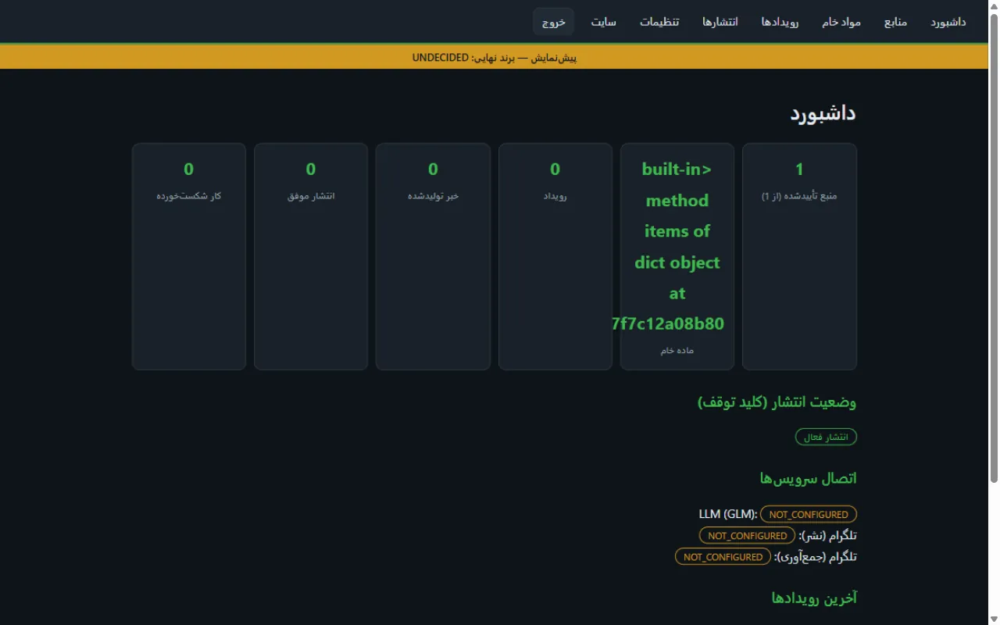
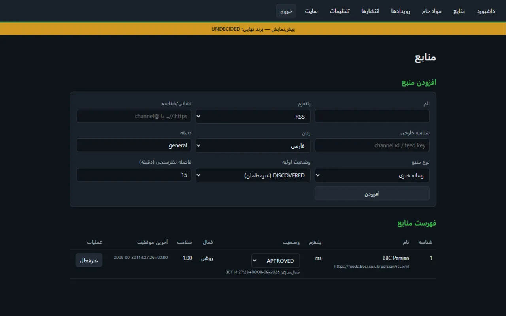
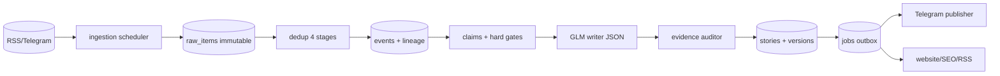

# فارسی

## akh-bot — تحریریه خودکار مبتنی بر شواهد (نام داخلی؛ برند عمومی: تعیین‌نشده)

[](https://github.com/DashSaman/akh-bot/actions/workflows/ci.yml)

پلتفرم سبک خبری چندزبانه که فقط منابع تأییدشده مدیر را رصد می‌کند:

```
جمع‌آوری (RSS/تلگرام) → نرمال‌سازی → حذف تکراری (۴ مرحله ارزان)
→ خوشه‌بندی رویداد → تبار منابع (شمارش خاستگاه مستقل، نه تعداد بازنشر)
→ استخراج ادعاهای اتمی → گیت‌های سخت راستی‌آزمایی → نگارش فارسی ساخت‌یافته (GLM)
→ ممیزی شواهد (هر جمله باید به ادعا ارجاع داشته باشد) → انتشار (تلگرام/وب)
→ دفتر انتشار idempotent + کلید توقف اضطراری
```

### ویژگی‌های کلیدی
- **حفاظت بازگشتی:** محتوای قدیمی‌تر از زمان فعال‌سازی منبع فقط ذخیره می‌شود (STORE_ONLY) هرگز منتشر نمی‌شود.
- **تبار منبع:** ۵ کانال که یک خبر رویترز را کپی کنند = ۵ گزارش، ۱ خاستگاه مستقل — نه ۵ تأیید.
- **گیت‌های پرخطر:** تلفات متعارض یا تک‌منبعی هرگز تیتر قطعی نمی‌شوند (وضعیت HELD).
- **تغییرناپذیری شواهد:** ویرایش پیام‌های تلگرام نسخه جدید می‌سازد، اصل حفظ می‌شود.
- **برند کاملاً پیکربندی‌پذیر:** `config/brand.yml` — تغییر برند بعداً بدون تغییر کد/دیتابیس/مسیر سرور.
- **سبک:** FastAPI + SQLite WAL + asyncio؛ بدون Redis/Celery/K8s؛ idle ~۶۰MB RAM.

### اجرای محلی
```bash
python -m venv .venv && .venv/Scripts/pip install -r requirements.txt pytest pytest-asyncio
.venv/Scripts/python -m pytest tests -q          # ۵۲ تست
cp .env.example .env                             # مقادیر را پر کنید
uvicorn app.main:app --port 8000                 # http://127.0.0.1:8000
```

### استقرار روی سرور
```bash
# روی سرور: /opt/akhbot/.env از .env.example ساخته شود (chmod 600)
bash scripts/deploy.sh          # بیلد + اجرای akhbot-app روی 127.0.0.1:8307
ssh -L 8307:127.0.0.1:8307 root@91.107.240.235   # تونل دسترسی
# پنل: http://127.0.0.1:8307/admin  —  سلامت: /health  —  سایت: /
```

### پنل مدیریت (فارسی RTL)





داشبورد، منابع (APPROVED/DISCOVERED/BLOCKED + زمان فعال‌سازی)، مواد خام، رویدادها/ادعاها، دفتر انتشار، تنظیمات (توقف کل/تک‌پلتفرمی). جزئیات کامل: `docs/ADMIN-PANEL.md`.

### معماری


### انتقال به سرور دیگر (خلاصه)
۱) بکاپ: `scripts/backup_db.sh` ← ۲) انتقال DB + `.env` ← ۳) کلون ریپو ← ۴) تنظیم رمزها ← ۵) `deploy.sh` ← ۶) `restore_db.sh` ← ۷) **`scripts/verify_instance.sh`** ← ۸) پایش ضربان‌ها
جزئیات: `docs/MIGRATION.md` · داده زمان‌اجرأ: `docs/RUNTIME-DATA.md` · چک‌لیست: `docs/NEW-SERVER-CHECKLIST.md`

مستندات کامل در `docs/` (دوزبانه برای مستندات کلیدی). نقشه راه: `docs/ROADMAP.md`.

---

# English

## akh-bot — automated evidence-based newsroom (internal name; public brand TBD)

A lightweight multilingual news platform monitoring ONLY admin-approved sources:

```
COLLECT (RSS/Telegram) → NORMALIZE → DEDUP (4 cheap stages)
→ EVENT CLUSTERING → SOURCE LINEAGE (independent origins, not repost count)
→ ATOMIC CLAIM EXTRACTION → VERIFICATION HARD GATES → structured Persian writing (GLM)
→ EVIDENCE AUDIT (every sentence must reference claims) → PUBLISH (Telegram/web)
→ idempotent publication ledger + emergency kill switches
```

### Key features
- **Backfill protection:** content older than a source's activation time is STORE_ONLY.
- **Source lineage:** 5 channels copying one Reuters story = 5 reports, 1 independent origin.
- **High-risk gates:** conflicting or single-source casualty figures never make definitive headlines (HELD).
- **Raw immutability:** Telegram edits create revisions; originals are preserved.
- **Fully configurable brand:** `config/brand.yml` — no code/DB/path renames ever needed.
- **Lightweight:** FastAPI + SQLite WAL + asyncio; no Redis/Celery/K8s; ~60 MB idle.

### Local run
```bash
python -m venv .venv && .venv/bin/pip install -r requirements.txt pytest pytest-asyncio
.venv/bin/python -m pytest tests -q               # 52 tests
cp .env.example .env
uvicorn app.main:app --port 8000
```

### Server deployment
```bash
# server: create /opt/akhbot/.env from .env.example (chmod 600)
bash scripts/deploy.sh           # builds + runs akhbot-app on 127.0.0.1:8307
ssh -L 8307:127.0.0.1:8307 root@91.107.240.235    # access tunnel
# admin: http://127.0.0.1:8307/admin — health: /health — site: /
```

### Admin panel (Persian RTL)
Dashboard, sources (APPROVED/DISCOVERED/BLOCKED + activation time), raw items,
events/claims, publication ledger, settings (global/per-platform pause). Full reference: `docs/ADMIN-PANEL.md`.

### Architecture
See mermaid diagram in the Persian section (identical).

Full documentation in `docs/` (bilingual for key docs). Roadmap: `docs/ROADMAP.md`.
